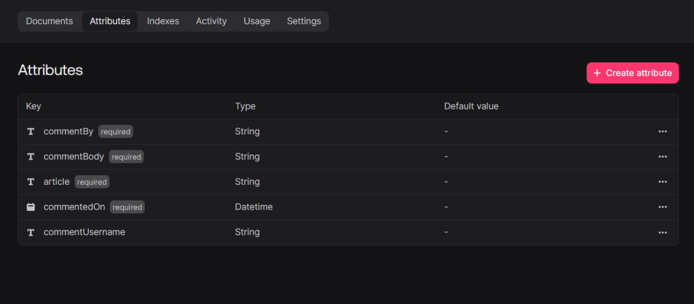
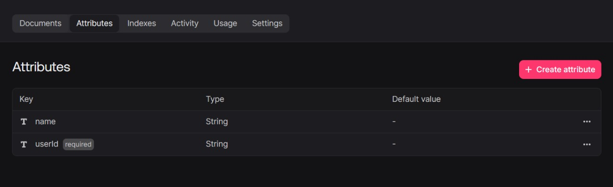

<h1 align="center">TechieBlog</h1>
<p align="center">
<a href="https://techie-blogs.vercel.app/"><strong>🚀 Live Demo</strong></a>
</p>
TechieBlog is a blogging platform that allows users to create, read, update, and delete blog posts. It provides a clean and user-friendly interface with essential features for content management. This project uses **Appwrite** as the backend, allowing for easy authentication, database management, and file storage.


<table align="center">
  <thead align="center">
    <tr>
      <td><b>🌟 Stars</b></td>
      <td><b>🍴 Forks</b></td>
      <td><b>🐛 Issues</b></td>
      <td><b>🔔 Open PRs</b></td>
      <td><b>🔕 Closed PRs</b></td>
      <td><b>🛠️ Languages</b></td>
    </tr>
  </thead>
  <tbody>
    <tr>
      <td></td>
      <td></td>
      <td></td>
      <td></td>
      <td></td>
      <td></td>
    </tr>
  </tbody>
</table>


## 👀 Table of Contents

- [👀 Table of Contents](#-table-of-contents)
- [🦾 Features](#-features)
- [🛠 Technologies Used](#-technologies-used)
- [🧩 Installation](#-installation)
  - [1. Prerequisites](#1-prerequisites)
  - [2. Steps](#2-steps)
  - [3. Setting Up Appwrite Keys for Contributors](#3-setting-up-appwrite-keys-for-contributors)
- [⚙ Usage](#-usage)
- [🛡 Contributing](#-contributing)
  - [🤝 Steps to Contribute](#-steps-to-contribute)
- [❤️ Our Contributors](#️-our-contributors)
- [⭐ Show Your Support](#-show-your-support)
- [🍴 Forkers](#-forkers)
- [License](#license)


## 🦾 Features

- User authentication (Login/Sign-up) via Appwrite
- Create, edit, and delete blog posts
- Categorize posts with tags and categories
- File upload support for images and media
- Responsive design for both desktop and mobile views


## 🛠 Technologies Used

- **Frontend**: HTML, CSS, JavaScript, Tailwind css , React
- **Backend**: Appwrite for user authentication, database, and file storage
- **Database**: Appwrite Database
- **Authentication**: Appwrite Authentication
- **Link**: [Click Here](https://techie-blogs.vercel.app/)


## 🧩 Installation

### 1. Prerequisites

- Node.js and npm (or yarn) installed on your machine.
- Appwrite instance running locally or on a cloud server.

### 2. Steps

1. Clone the repository:
   ```bash
   git clone https://github.com/SumitGorai01/TechieBlog.git
2. Navigate into the project directory:

    ```bash
    cd TechieBlog
3. Install the dependencies:

    ```bash
    npm install
4. Set up Appwrite:
If you don’t have an Appwrite account, follow these steps:
    1. Register for an account on the [Appwrite website]().
    2. Verify your email address.
    3. Log in to your Appwrite account.
    4. Create a new project in Appwrite to organize your resources.
    5. Set up a new database in the project to store data.
    6. Create a new collection within the database to organize data documents.
    7. Add necessary permissions and document security settings for the created collection.
    8. Set up storage and create a bucket in Appwrite to store files.
    9. Add necessary permissions and document security settings for the storage bucket.
    10. Generate an API key and configure Appwrite SDK in your project.

5. Set up TinyMCE:
    1. Simply create an account on [TinyMCE website](https://www.tiny.cloud/).
    2. Get your API key.

6. Configure environment variables for:

    Create a .env file in the root directory and replace the following with .env.sample 

    ```bash    
    VITE_APPWRITE_URL = "https://cloud.appwrite.io/v1"
    # VITE_APPWRITE_URL=https://fra.cloud.appwrite.io/v1
    VITE_APPWRITE_PROJECT_ID = ""
    VITE_APPWRITE_DATABASE_ID = ""
    VITE_APPWRITE_COLLECTION_ID = ""
    VITE_APPWRITE_BUCKET_ID = ""
    VITE_API_KEY = ""
    VITE_APPWRITE_COMMENT_COLLECTION_ID = ""
    # VITE_BASE_LINK = 'https://techie-blogs.vercel.app/'
    VITE_BASE_LINK = 'http://localhost:5173/'
    VITE_APPWRITE_USER_COLLECTION_ID = ""
    VITE_APPWRITE_EVENT_ID=""
    VITE_APPWRITE_SAVEFORLATER_COLLECTION_ID=""
    VITE_EMAILJS_SERVICE_ID=""
    VITE_EMAILJS_TEMPLATE_ID = ""
    VITE_EMAILJS_PUBLIC_KEY = ""
    VITE_EMAILJS_SERVICE_ID_FEEDBACK = ""
    VITE_EMAILJS_TEMPLATE_ID_FEEDBACK =""
    VITE_EMAILJS_PUBLIC_KEY_FEEDBACK =""
    ```
    
7. Start the application:
    
    ```bash
    npm run dev
    ```
8. The app should now be running at http://localhost:5173 (or another specified port).

### 3. Setting Up Appwrite Keys for Contributors
To contribute to the TechieBlog project, you need to set up your own Appwrite instance and obtain the required keys. Follow these steps:

1. Create an Appwrite Account
    - Go to the Appwrite website.
    - Click on Sign Up and create a new account.
    - Verify your email address to activate your account.


2. Create a New Project
    - Log in to your Appwrite account.
    - Click on Create Project.
    - Name your project (e.g., TechieBlog) and click Create.


3. Set Up a Database
    - In your project dashboard, go to the Database section.
    - Click on Create Database.
    - Name your database (e.g., TechieBlogDB) and click Create.
    - Inside the database, create a collection for blog posts:
    - Click on Create Collection.
    - Name it (e.g., Posts) and configure permissions (e.g., read/write access for users).
    - Create another collection for comments:
    - Click on Create Collection.
    - Name it (e.g., Comments) and configure permissions.

Overall Database
Article Schema

Comment Schema
Events
savedForLater
users
Permissions

1. Set Up Storage
    - In your project dashboard, go to the Storage section.
    - Click on Create Bucket.
    - Name your bucket (e.g., BlogImages) and configure permissions (e.g., read/write access for users).


5. Generate API Keys
    - In your project dashboard, go to the API Keys section.
    - Click on Create API Key.
    - Select the required scopes (e.g., Database, Storage, Users).
    - Click Create and copy the generated API key.


Docker Setup✅

Run the application in a containerized environment using Docker.
Prerequisites: Docker desktop installed

1. Build the Docker Image and run all these commands in terminal :-

docker build . -t techieblog

2. Run the Container :-

docker run -d -p 5173:5173 techieblog


## ⚙ Usage
Once the app is running, you can:

1. Register an account and log in using Appwrite authentication
2. Start creating and managing blog posts
3. Add tags, categories, and images to posts
Comment on other users' posts


## 🛡 Contributing

Contributions are welcome! Please fork the repository and submit a pull request. Before contributing, ensure that the tests pass and the code adheres to the project's coding standards.


### 🤝 Steps to Contribute
1. Fork the repository
2. Create a new branch (git checkout -b feature/your-feature)
3. Make your changes and commit them
4. Push to the branch (git push origin feature/your-feature)
5. Create a pull request to the main repository


## ❤️ Our Contributors

<a href="https://github.com/SumitGorai01/TechieBlog/graphs/contributors">
  
</a>


## ⭐ Show Your Support

If you found this project helpful, please consider giving it a ⭐️

[](https://github.com/SumitGorai01/TechieBlog/stargazers)


## 🍴 Forkers

[](https://github.com/SumitGorai01/TechieBlog/network/members)


## License


Note: This project uses a **modified MIT License** that includes additional restrictions.  
Please see the [LICENSE](./LICENSE) file for more details.

